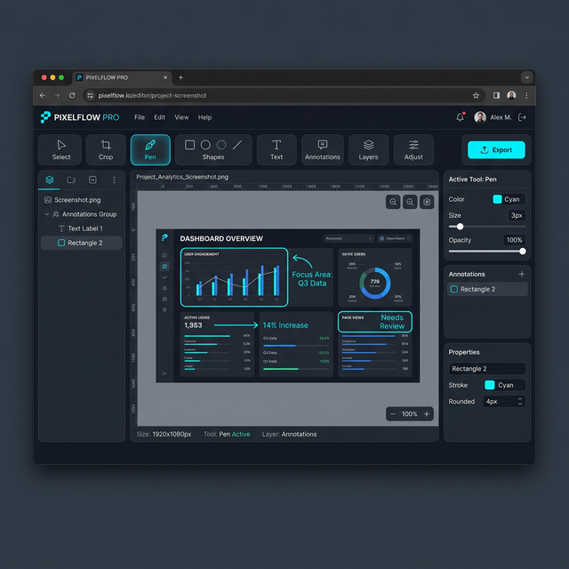

# 📸 Element Snap MVP

**Element Snap** is a powerful browser extension that allows you to easily capture specific HTML elements (nodes) from web pages, annotate them, and export them as high-quality images.

---

## ✨ Features

### 🎯 Smart Element Selection
*   **Precision Capture:** Instantaneously identify any HTML element (div, button, section, etc.) on the page just by hovering your mouse.
*   **Live Highlighting:** Elements are highlighted with a bright border in selection mode, so you always know exactly what you're capturing.
*   **One-Click Snap:** No more fumbling with complex screenshot tools. Just click the desired area to open the editor.

### 🎨 Advanced Editor

*   **Object-Based Rendering:** Every shape you draw is an object; you can move or delete them later.
*   **Rich Toolset:**
    *   **Pen:** Freehand drawing for quick notes.
    *   **Geometric Shapes:** Add rectangles to emphasize important areas.
    *   **Arrows:** Point out flows or specific points of interest.
    *   **Text:** Add descriptions and annotations directly on the image.
    *   **Eraser:** Layered erasing allows you to fix mistakes easily.
*   **Color Palette:** Choose colors that fit your brand or needs.
*   **Crop:** Further customize your captured image.
*   **Zoom & Pan:** Work with precision by zooming between 10% and 500%.

### 💾 Flexible Export
*   **Multi-format:** Save your work as **PNG**, **JPG**, or **PDF**.
*   **Copy to Clipboard:** One-click copy to paste directly into Slack, WhatsApp, email, or other apps without downloading.
*   **Quick Download:** Save to your computer instantly with maximum quality.

---

## ⌨️ Shortcuts

Designed for maximum productivity:

| Action | Shortcut |
| :--- | :--- |
| **Start Selection Mode** | `Alt + Shift + S` |
| **Exit Mode / Cancel** | `Esc` |
| **Undo** | `Ctrl + Z` |
| **Select / Move Tool** | `V` |
| **Eraser Tool** | `E` |
| **Pen Tool** | `P` |
| **Text Tool** | `T` |

---

## 🚀 Installation

1.  Download or clone this repository to your computer.
2.  Open Chrome and navigate to `chrome://extensions/`.
3.  Enable **"Developer Mode"** using the toggle in the top right corner.
4.  Click the **"Load unpacked"** button and select this project folder.
5.  Pin the extension and start snapping!

---

## 🛠️ Technical Details

*   **Manifest V3:** Built using the latest Chrome extension standards.
*   **Vanilla JS:** Developed with pure JavaScript, no heavy frameworks (React/Vue) required.
*   **Canvas 2D API:** High-performance image processing and drawing system.
*   **jsPDF:** Integrated for seamless PDF exports.
*   **i18n Support:** Fully internationalized and ready for multiple locales.

---

## 📝 License

This project is licensed under the [MIT License](./LICENSE). Feel free to use and contribute!
